  <!-- Animated Cyber-Bot Character -->
  

  # Mahmoud Walid
  ### ⚡ Vibe Coder &bull; AI-Native Engineer &bull; Fullstack Systems Builder

  

    
    
    
  

  

    <em>"The future of engineering is prompt-to-production: orchestrating autonomous AI agents, enforcing Clean Architecture, and turning visionary ideas into resilient software."</em>
  

  

    <a href="#-about-me">About Me</a> &bull;
    <a href="#-featured-systems">Featured Systems</a> &bull;
    <a href="#-tech-stack--superpowers">Tech Stack</a> &bull;
    <a href="#-github-telemetry">Telemetry</a>
  

---

### 🛸 About Me

- 🧠 **AI-Native Engineering**: I orchestrate AI agents (Antigravity, Cursor, Claude Code) to build production-grade web applications and machine learning platforms in record time.
- 📐 **Architecture Rigor**: Fast execution doesn't mean sloppy code. I adhere strictly to **Clean Architecture**, systematic design tokens, 4px modular scales, and the **Doherty Threshold (<400ms)** for instantaneous user perception.
- 👁️ **Computer Vision & ML**: Experienced in computer vision systems (facial detection, recognition networks, automation pipelines) and real-time edge processing.
- 🚀 **Portfolio Web**: Live interactive portfolio with dynamic GitHub REST sync and a playable Cyber Terminal emulator.

---

### ⚡ Featured Systems & Live Applications

| Project | Domain / Tech | Description | Status / Demo |
| :--- | :--- | :--- | :--- |
| **[DEPI Face Recognition](https://github.com/Mahmoud-Walid1/DEPI-face-recognition-project)** | `Python` &bull; `OpenCV` &bull; `ML` | Machine learning face detection & identification system for Digital Egypt Pioneers Initiative. |  |
| **[InterActive Lessons](https://github.com/Mahmoud-Walid1/InterActive_lessons-test)** | `React` &bull; `Python` &bull; `Vercel` | High-engagement interactive learning platform with real-time feedback loops. | [Live Demo](https://inter-active-lessons-test.vercel.app) |
| **[Tikka Plate Platform](https://github.com/Mahmoud-Walid1/Tikka_plate)** | `JavaScript` &bull; `HTML/CSS` | Responsive food ordering and menu management client portal. | [Live Demo](https://tikka-plate.vercel.app) |
| **[Tikka Plate Admin](https://github.com/Mahmoud-Walid1/Tikka_plate_admin)** | `JavaScript` &bull; `Admin UI` | Administrative operations panel with inventory and order tracking workflows. | [Live Demo](https://tikka-plate-admin.vercel.app) |
| **[Graduation Landing Page](https://github.com/Mahmoud-Walid1/Graduation-landing-page)** | `CSS3` &bull; `Animation` | High-impact showcase landing page featuring fluid kinetic transitions. | [Live Demo](https://graduation-landing-page-three.vercel.app) |

---

### 🛠️ Tech Stack & Superpowers

#### AI & Autonomous Workflows

#### Frontend & UI/UX Architecture

#### Backend & Computer Vision

---

### 📊 GitHub Telemetry & Stats

  
  

   

  

---

  Constructed with clean engineering discipline by Mahmoud Walid &bull; All systems operational

